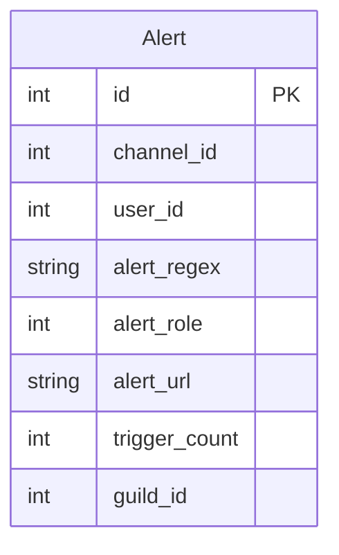

# Alert (BatPhone) Database Schema

> **Note:** This documentation is primarily AI-generated from the source code and may contain inaccuracies. Always verify behavior against the actual implementation.

Source: `roboToald/db/models/alert.py`

## Entity Relationship Diagram

## Table

### Alert

Each row is a user-registered webhook alert that fires when a message in a specific channel matches a regex pattern.

| Column | Type | Constraints | Description |
|---|---|---|---|
| `id` | Integer | PK | |
| `channel_id` | Integer | | Discord channel to monitor |
| `user_id` | Integer | | Discord user who registered the alert |
| `alert_regex` | String(255) | | Regex pattern to match against message content |
| `alert_role` | Integer | | Discord role ID to ping when triggered (0 = no ping) |
| `alert_url` | String(100) | | Webhook URL to POST when triggered (e.g. SquadCast) |
| `trigger_count` | Integer | | Number of times this alert has fired (initialized to 0) |
| `guild_id` | Integer | | Discord guild |

**Unique constraint:** `(user_id, channel_id, alert_regex, alert_url)`

## How Alerts Trigger

1. The bot's `on_message` handler (in `discord_client/base.py`) checks every incoming message against all alerts registered for that channel.
2. For each alert whose `alert_regex` matches the message content, the bot POSTs the message to `alert_url` (SquadCast webhook format) and optionally pings `alert_role`.
3. The `trigger_count` is incremented on each match.

Registered channels are cached via `get_registered_channels()` so that `on_message` can skip channels with no alerts.
