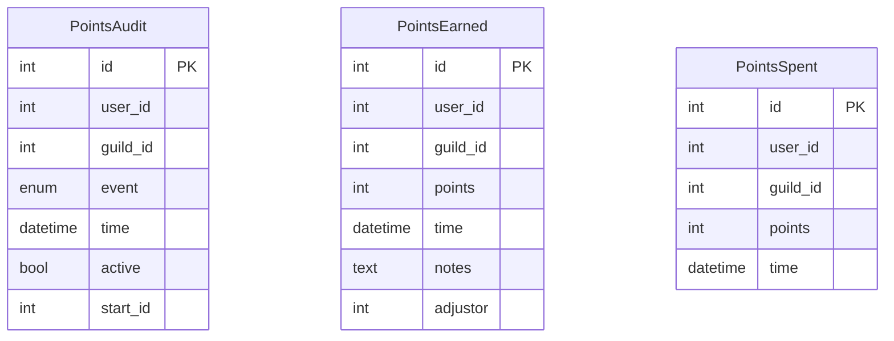

# Points Database Schema

> **Note:** This documentation is primarily AI-generated from the source code and may contain inaccuracies. Always verify behavior against the actual implementation.

Source: `roboToald/db/models/points.py`, `roboToald/constants.py`

Used by the Drusella Sathir camp-time tracking system (`/ds` commands).

## Entity Relationship Diagram

The three tables are independent -- there are no foreign key relationships between them. They share the common fields `user_id`, `guild_id`, and `time` for consistent querying.

## Tables

### PointsAudit

Tracks camp-time events (clock in/out, quake windows, DS pops). Events are paired: a start event is linked to its corresponding end event via `start_id`.

| Column | Type | Constraints | Description |
|---|---|---|---|
| `id` | Integer | PK, auto-increment | |
| `user_id` | Integer | | Discord user ID (`0` for system events like quake windows) |
| `guild_id` | Integer | | |
| `event` | Enum(Event) | | Event type |
| `time` | DateTime | | When the event occurred |
| `active` | Boolean | default `True` | `True` = ongoing/open, `False` = closed/paired |
| `start_id` | Integer | nullable | References `PointsAudit.id` of the paired start event |

**Event enum** (`constants.Event`):
- `IN` -- member clocked in (start camping)
- `OUT` -- member clocked out (stop camping)
- `COMP_START` -- legacy (unused, kept for backward compatibility with existing DB rows)
- `COMP_END` -- legacy (unused, kept for backward compatibility with existing DB rows)
- `POP` -- Drusella Sathir death recorded (time of death)

**Event pairing:** An `IN` event with `active=True` means the member is currently camping. When they clock out, the `IN` event is set to `active=False` and an `OUT` event is created with `start_id` pointing to the `IN` event.

System events (`user_id=0`) track pop times.

### PointsEarned

Records points awarded to members. Points are calculated from camp time and written here by the bot.

| Column | Type | Constraints | Description |
|---|---|---|---|
| `id` | Integer | PK, auto-increment | |
| `user_id` | Integer | | Discord user ID |
| `guild_id` | Integer | | |
| `points` | Integer | | Points awarded |
| `time` | DateTime | | When points were awarded |
| `notes` | Text | | Context (e.g. "camp time", "adjustment") |
| `adjustor` | Integer | | Discord user ID of the admin who awarded points (for manual adjustments) |

### PointsSpent

Records points spent by members (urn purchases).

| Column | Type | Constraints | Description |
|---|---|---|---|
| `id` | Integer | PK, auto-increment | |
| `user_id` | Integer | | Discord user ID |
| `guild_id` | Integer | | |
| `points` | Integer | | Points spent |
| `time` | DateTime | | When points were spent |

**Balance** = sum of `PointsEarned.points` - sum of `PointsSpent.points` for a given user and guild.

## Points Calculation

Points are earned based on camp time between a member's `IN` and `OUT` events, calculated against the time since the last `POP` event. Key configuration values (from `batphone.ini [ds]`):

- `skp_baseline` (default 46) -- baseline points per eligible period
- `skp_minimum` (default 1) -- minimum points awarded for any camp session
- `skp_plateau_minute` (default 1200) -- minute at which the point curve plateaus
- `skp_starttime` (default 480) -- camp start-time threshold in minutes
- `offhours_start` / `offhours_end` / `offhours_zone` -- off-hours window for bonus multiplier
