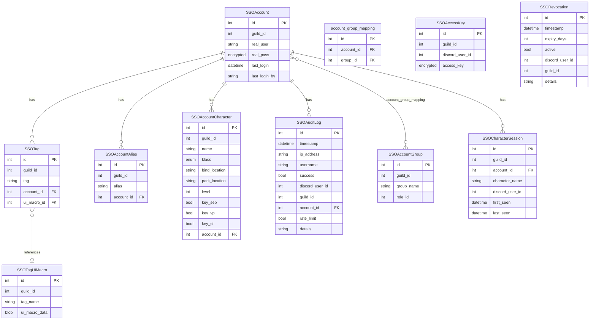

# SSO Database Schema

> **Note:** This documentation is primarily AI-generated from the source code and may contain inaccuracies. Always verify behavior against the actual implementation.

Source: `roboToald/db/models/sso.py`

## Entity Relationship Diagram



## Tables

### SSOAccount

Represents a real EverQuest account with encrypted credentials.

| Column | Type | Constraints | Description |
|---|---|---|---|
| `id` | Integer | PK, auto-increment | |
| `guild_id` | Integer | NOT NULL | Discord guild this account belongs to |
| `real_user` | String(255) | NOT NULL | EQ account username (stored lowercase) |
| `real_pass` | EncryptedType(String) | NOT NULL | EQ account password (encrypted at rest) |
| `last_login` | DateTime | default `datetime.min` | Last time this account was used for login |
| `last_login_by` | String(255) | nullable | Display name of the Discord user who last logged in |

**Unique constraint:** `(guild_id, real_user)`

**Relationships:** groups (M2M via `account_group_mapping`), tags (1:N), aliases (1:N), characters (1:N, cascade delete), audit_logs (1:N)

### SSOAccountGroup

Links a Discord role to a set of accounts for RBAC.

| Column | Type | Constraints | Description |
|---|---|---|---|
| `id` | Integer | PK, auto-increment | |
| `guild_id` | Integer | NOT NULL | |
| `group_name` | String(255) | NOT NULL | Human-readable group name |
| `role_id` | Integer | NOT NULL | Discord role ID granting access |

**Unique constraint:** `(guild_id, group_name)`

**Relationships:** accounts (M2M via `account_group_mapping`)

### account_group_mapping

Junction table for the many-to-many relationship between accounts and groups.

| Column | Type | Constraints |
|---|---|---|
| `id` | Integer | PK |
| `account_id` | Integer | FK -> `sso_account.id` |
| `group_id` | Integer | FK -> `sso_account_group.id` |

**Unique constraint:** `(account_id, group_id)`

### SSOAccessKey

Per-user-per-guild encrypted access key used as the "password" in API authentication.

| Column | Type | Constraints | Description |
|---|---|---|---|
| `id` | Integer | PK, auto-increment | |
| `guild_id` | Integer | NOT NULL | |
| `discord_user_id` | Integer | NOT NULL | |
| `access_key` | EncryptedType(String) | UNIQUE, indexed | Generated passphrase (e.g. `ConcentrateRedundantCollar`) |

**Unique constraint:** `(guild_id, discord_user_id)`

Access keys are generated automatically on first request (`/sso access get`) using random verb+adjective+noun combinations from word lists.

### SSOTag

A named tag applied to one or more accounts. Logging in with a tag name picks the least-recently-used inactive account among all accounts sharing that tag.

| Column | Type | Constraints | Description |
|---|---|---|---|
| `id` | Integer | PK, auto-increment | |
| `guild_id` | Integer | NOT NULL | |
| `tag` | String(255) | NOT NULL | Tag name (stored lowercase) |
| `account_id` | Integer | FK -> `sso_account.id` | |
| `ui_macro_id` | Integer | FK -> `sso_tag_ui_macro.id`, nullable | Optional UI macro blob |

**Unique constraint:** `(tag, account_id)`

**Tag login selection:** accounts are sorted by a bucketed last-login age (30-second buckets for the first 20 minutes, then all equivalent) with highest character level as tiebreaker.

### SSOTagUIMacro

Stores a UI macro binary blob associated with a tag name. Multiple tags can reference the same macro.

| Column | Type | Constraints | Description |
|---|---|---|---|
| `id` | Integer | PK, auto-increment | |
| `guild_id` | Integer | NOT NULL | |
| `tag_name` | String(255) | NOT NULL | Tag name this macro is for (lowercase) |
| `ui_macro_data` | BLOB | NOT NULL | Binary UI macro data |

**Unique constraint:** `(tag_name, guild_id)`

### SSOAccountAlias

An alternative name for a single account. Logging in with an alias resolves to the aliased account directly.

| Column | Type | Constraints | Description |
|---|---|---|---|
| `id` | Integer | PK, auto-increment | |
| `guild_id` | Integer | NOT NULL | |
| `alias` | String(255) | NOT NULL | Alias name (stored lowercase) |
| `account_id` | Integer | FK -> `sso_account.id` | |

**Unique constraint:** `(alias, guild_id)`

### SSOAccountCharacter

Maps a character name and class to an account. Characters have optional bind/park locations and level used for dynamic tag resolution. Zone keys (`key_seb`, `key_vp`, `key_st`) are tri-state: null = unknown, true/false = confirmed.

| Column | Type | Constraints | Description |
|---|---|---|---|
| `id` | Integer | PK, auto-increment | |
| `guild_id` | Integer | NOT NULL | |
| `name` | String(64) | NOT NULL | Character name |
| `klass` | Enum(CharacterClass) | NOT NULL | Character class |
| `bind_location` | String(64) | nullable | Zone key where character is bound |
| `park_location` | String(64) | nullable | Zone key where character is parked |
| `level` | Integer | nullable | Character level |
| `key_seb` | Boolean | nullable | Trakanon Idol / Old Sebilis key |
| `key_vp` | Boolean | nullable | Key of Veeshan |
| `key_st` | Boolean | nullable | Sleeper's Key |
| `account_id` | Integer | FK -> `sso_account.id`, NOT NULL | |

**Unique constraint:** `(name, guild_id)`

**CharacterClass enum:** Bard, Cleric, Druid, Enchanter, Magician, Monk, Necromancer, Paladin, Ranger, Rogue, ShadowKnight, Shaman, Warrior, Wizard

### SSOCharacterSession

Tracks contiguous heartbeat sessions for characters. A new row is created when a heartbeat arrives with no recent session (last_seen older than the inactivity threshold). Subsequent heartbeats extend the existing session.

| Column | Type | Constraints | Description |
|---|---|---|---|
| `id` | Integer | PK, auto-increment | |
| `guild_id` | Integer | NOT NULL | |
| `account_id` | Integer | FK -> `sso_account.id`, NOT NULL | |
| `character_name` | String(64) | NOT NULL | |
| `discord_user_id` | Integer | NOT NULL | Who is playing this session |
| `first_seen` | DateTime | NOT NULL | When session started |
| `last_seen` | DateTime | NOT NULL | Last heartbeat received |

Used to determine `active_character` in the account tree and for session history queries.

### SSORevocation

Blocks a Discord user's access to the SSO system, with an optional time-based expiry.

| Column | Type | Constraints | Description |
|---|---|---|---|
| `id` | Integer | PK, auto-increment | |
| `timestamp` | DateTime | NOT NULL | When the revocation was created |
| `expiry_days` | Integer | NOT NULL | Days until expiry (`0` = permanent) |
| `active` | Boolean | default `True` | Set to `False` when removed by admin |
| `discord_user_id` | Integer | NOT NULL | Revoked user |
| `guild_id` | Integer | NOT NULL | |
| `details` | String(255) | nullable | Reason for revocation |

A user is considered revoked if any active revocation exists that is either permanent (`expiry_days = 0`) or has not yet expired.

### SSOAuditLog

Records every API authentication attempt for security monitoring.

| Column | Type | Constraints | Description |
|---|---|---|---|
| `id` | Integer | PK, auto-increment | |
| `timestamp` | DateTime | NOT NULL | |
| `ip_address` | String(45) | nullable | Client IP (supports IPv6) |
| `username` | String(255) | NOT NULL | Username used in the attempt |
| `success` | Boolean | default `False` | |
| `discord_user_id` | Integer | nullable | Resolved Discord user (if key was valid) |
| `guild_id` | Integer | nullable | May be NULL for failed attempts |
| `account_id` | Integer | FK -> `sso_account.id`, nullable | Resolved account (if found) |
| `rate_limit` | Boolean | default `True` | Set to `False` when admin clears rate limit |
| `details` | String(255) | nullable | Failure reason or success details |

Rate limiting counts failed attempts where `rate_limit != False` and `account_id IS NOT NULL` (or `username = 'list_accounts'`), within a rolling 30-minute window, threshold of 20.

## RBAC Access Model

```
Discord User's Roles
        |
        v
SSOAccountGroup (role_id matches any user role)
        |
        v  (via account_group_mapping)
SSOAccount (accessible)
```

A user can access an account if they hold any Discord role whose ID matches the `role_id` of any group the account belongs to. This check is performed as a single bulk query joining `account_group_mapping` with `SSOAccountGroup` filtered by role IDs.

## Dynamic Tags

Dynamic tags are computed zone+class combinations that are not stored in the database. They are generated from hardcoded zone prefixes and class suffixes.

**Zone prefixes:** `vp`, `st`, `tov`, `dn`, `kael`, `pog`, `thurg`, `ss`, `fear`, `vox`, `naggy` (plus aliases `dain`=thurg, `yeli`=ss, `zlandi`=dn)

**Class suffixes:** `bar`/`brd`/`bard`, `clr`/`cle`/`cleric`, `dru`/`druid`, `enc`/`enchanter`, `mag`/`mage`/`magician`, `mnk`/`mon`/`monk`, `nec`/`necro`/`necromancer`, `pal`/`pld`/`paladin`, `ran`/`rng`/`ranger`, `rog`/`rogue`, `sk`/`shadowknight`, `sha`/`shm`/`sham`/`shaman`, `war`/`warrior`, `wiz`/`wizard`

A dynamic tag like `vpclr` resolves to: find inactive characters of class Cleric whose `bind_location` or `park_location` is in the `vp` zone set (`veeshan`, `skyfire`). Among matches, pick the account with the best login-age + level sort key.

## Auth Flow

1. Client sends `POST /auth {username, password}` (or authenticates via WebSocket).
2. API looks up `password` in `SSOAccessKey` to get `discord_user_id` and `guild_id`.
3. API checks for active `SSORevocation` for the user.
4. API resolves `username` through the resolution chain (account -> character -> alias -> tag -> dynamic tag).
5. API checks RBAC: user's Discord roles -> matching groups -> account membership.
6. On success: updates `last_login`, creates a success audit log, returns real credentials.
7. On failure: creates a failure audit log, returns generic 401.
