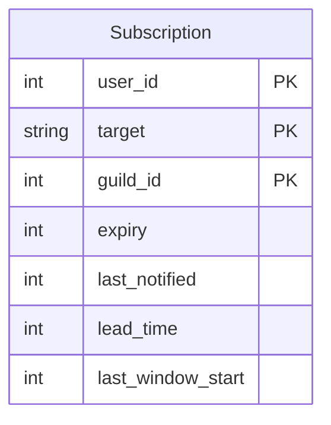

# Subscription Database Schema

> **Note:** This documentation is primarily AI-generated from the source code and may contain inaccuracies. Always verify behavior against the actual implementation.

Source: `roboToald/db/models/subscription.py`

Used by the raid-window subscription system (`/raidtarget` commands).

## Entity Relationship Diagram

## Table

### Subscription

Each row is a user's subscription to a specific raid target. The user receives DM notifications when the target's raid window opens or is approaching.

| Column | Type | Constraints | Description |
|---|---|---|---|
| `user_id` | Integer | PK (composite) | Discord user ID |
| `target` | String(255) | PK (composite) | Raid target name |
| `guild_id` | Integer | PK (composite), NOT NULL | Discord guild |
| `expiry` | Integer | NOT NULL | Unix timestamp when this subscription expires |
| `last_notified` | Integer | default `0` | Unix timestamp of last notification sent |
| `lead_time` | Integer | NOT NULL, default `1800` | Seconds before window open to send notification (default 30 minutes) |
| `last_window_start` | Integer | default `0` | Unix timestamp of the last window start that triggered a notification |

**Primary key:** `(user_id, target, guild_id)` -- a user can subscribe to the same target in different guilds but cannot have duplicate subscriptions within a guild.

## Notification Flow

1. A background task (`announce_subscriptions_task`) runs every ~60 seconds.
2. It fetches raid target data from the configured `raidtargets_endpoint` for each guild.
3. For each subscription, it checks:
   - Has the subscription expired? If so, it is cleaned up.
   - Is a raid window currently open or within `lead_time` seconds of opening?
   - Has a notification already been sent for this specific window (`last_window_start` match)?
4. If conditions are met, the bot DMs the user with the raid target details.
5. `last_notified` and `last_window_start` are updated to prevent duplicate notifications.

## Expiry and Renewal

- Subscriptions are created with a 30-day expiry (`time.time() + 30 days`).
- When a notification is sent, it includes a "Refresh" button that extends the expiry by another 30 days.
- An "Unsubscribe" button is also included for easy removal.
- Expired subscriptions are cleaned up by `clean_expired_subscriptions()`.
