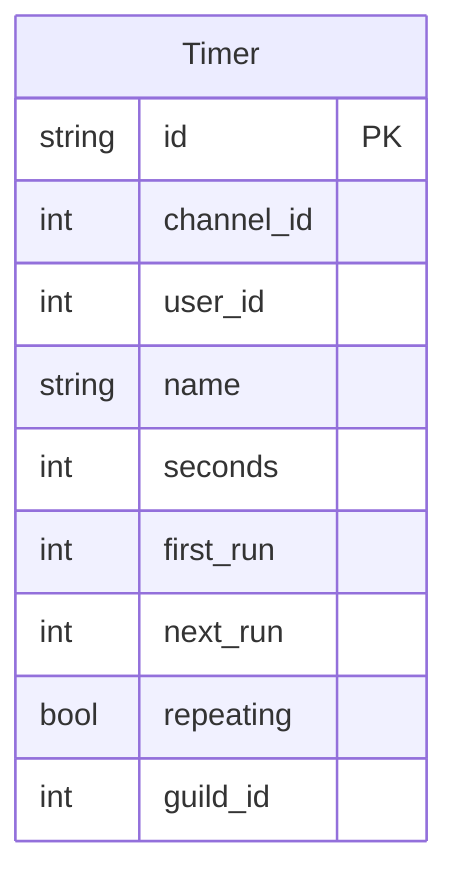

# Timer Database Schema

> **Note:** This documentation is primarily AI-generated from the source code and may contain inaccuracies. Always verify behavior against the actual implementation.

Source: `roboToald/db/models/timer.py`

## Entity Relationship Diagram

## Table

### Timer

Each row is a countdown timer that posts a notification in a Discord channel when it fires.

| Column | Type | Constraints | Description |
|---|---|---|---|
| `id` | String(8) | PK | Short alphanumeric ID (not auto-increment) |
| `channel_id` | Integer | | Discord channel where the timer notification will post |
| `user_id` | Integer | | Discord user who created the timer |
| `name` | String(100) | | Timer label |
| `seconds` | Integer | | Duration in seconds between fires |
| `first_run` | Integer | | Unix timestamp of the first scheduled fire |
| `next_run` | Integer | | Unix timestamp of the next scheduled fire |
| `repeating` | Boolean | | If `True`, reschedules after each fire; if `False`, deleted after firing |
| `guild_id` | Integer | | Discord guild |

## Behavior

- **ID format:** 8-character string (not auto-incrementing integer), providing readable identifiers for `/timer show` and `/timer stop`.
- **Quota:** The model sets `__use_quota__ = True`, limiting the number of active timers per user.
- **Scheduling:** `first_run` records when the timer was originally set. `next_run` is advanced by `seconds` after each fire for repeating timers.
- **Persistence:** On bot restart (`on_ready`), all timers are loaded from the database and their scheduled tasks are restored.
- **One-time timers** fire once and are deleted. **Repeating timers** update `next_run = next_run + seconds` and continue.
